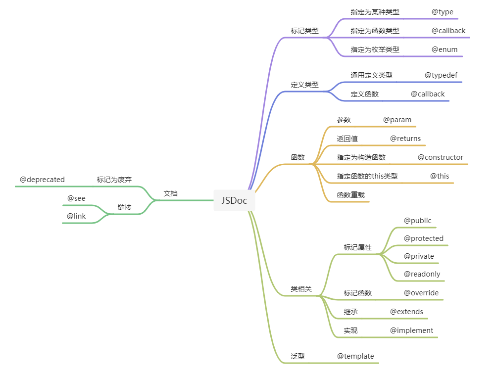

# jsdoc-learning

通过代码学习 [TypeScript 支持](https://www.typescriptlang.org/docs/handbook/jsdoc-supported-types.html) 的 JSDoc 语法的使用

## JSDoc 脑图

下面这个脑图是按用途的方式来罗列了 `JSDoc` 中的标签，也可以按这个图来检索或者学习具体的标签。

## 使用方法

- 鼠标移到对应的变量、方法上查看提示的类型。
- 点击相应的属性等可以跳转到定义的地方。
- 可删除 JSDoc 后对比下前后变化。
- 在相关示例后实际编写代码体验代码提示、代码补全和类型检查的效果。
- practice 部分添加了4个 JSDoc 使用示例，其中前2个比较简单，第3个中等，最后一个较复杂。

## practice 示例说明

可以从每个示例的 index.js 文件入手，一点点去查看变量、方法、参数、返回值的类型，然后再去看具体是怎么实现的。

### form-rules

里面用到了 `@typedef` `@callback` `param` `returns` 这几个标签，还涉及到了 TS 中的工具类型 `Record` 以及 元组类型的用法。

### enum

里面用到了 `enum` `@type` `param` 这几个标签，基本上可以实现 TypeScript 中 enum 的用法。

### store

这算是一个综合的示例，是一个微信小程序环境下状态管理示例，里面用到了平时开发中经常会用到的大部分 JSDoc 标签。其中 `createStore` 会把配置对象中的函数变成 mbox 中的 action，并且生成的 store 对象依然保留了直接访问属性和方法的能力； `createStoreBehavior` 利用 behaviors （相当于 Vue 的 mixin） 的能力，可以把 store 的 属性和 action 映射到 Page 对象或者 Component 对象上，方便在 wxml 中直接使用。

### wx-axios

这个示例相对稍复杂，wx-axios 目录下是对 axios 库在微信小程序环境下大部分功能的封装。除了其他使用的 JSDoc 标签外，还大量使用到了提供泛型能力的 `template` 标签。这里可以关注一下封装后，在写请求时，options 参数可以提示自定义格式的参数（比如：showLoading, loadingMsg, resultValidator 等），.then 的结果里面也能获取到是有一个 data 属性。然后进一步可以再去看一下里面是怎么实现的。
